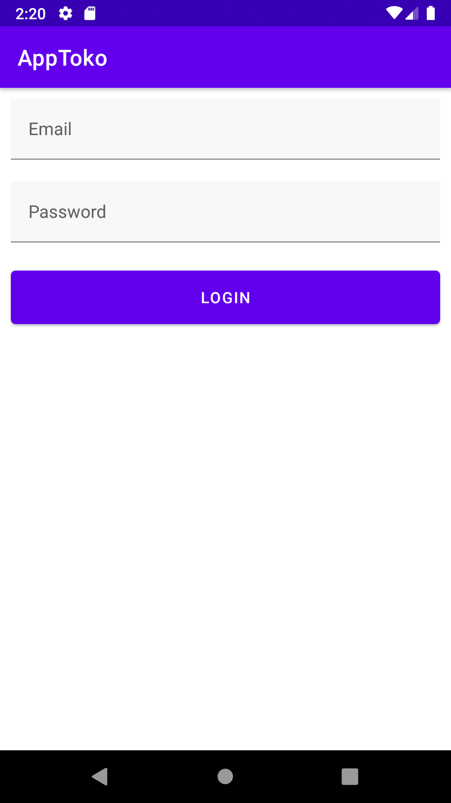
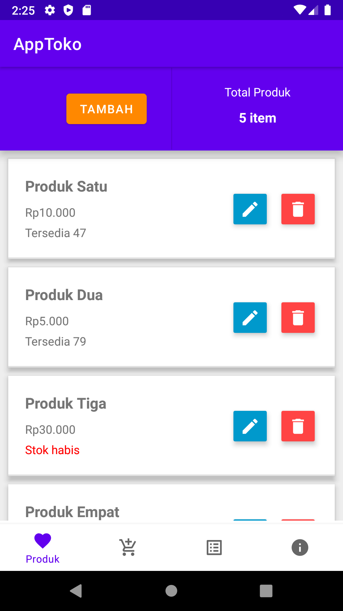
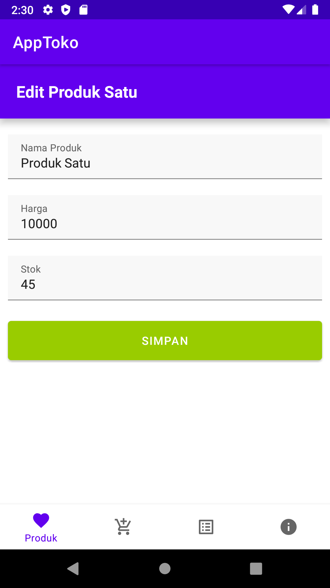
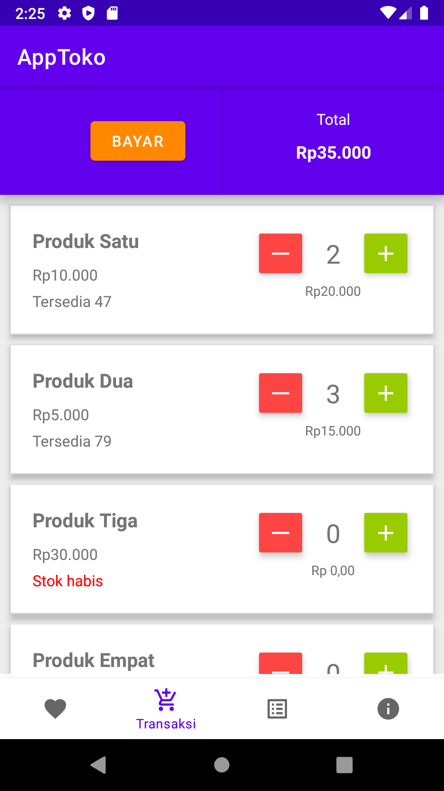
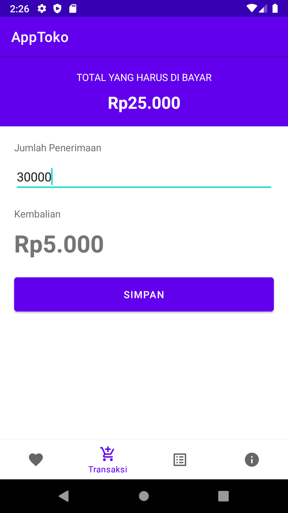
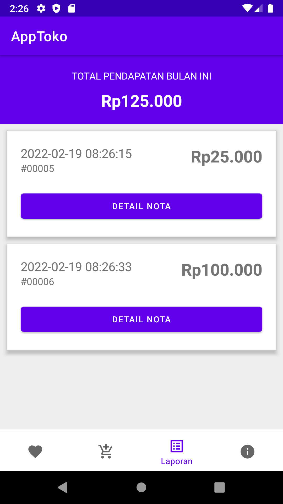
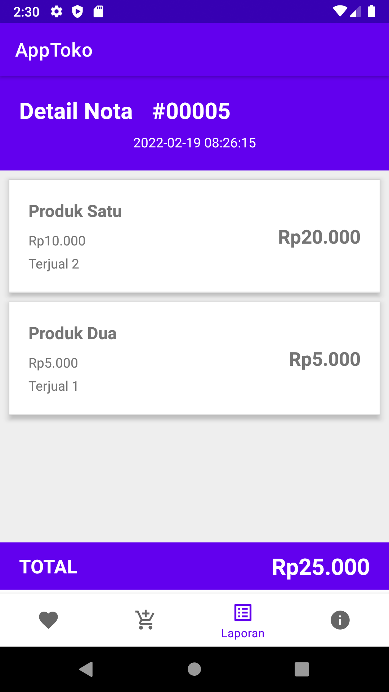

# About
Aplikasi POS (Point of Sales) berbasis android, dengan mengimplementasikan API.

## Requirement
- [Backend API](../../../ci-pcs).

## Screenshot
      

## Keterangan
Dibuat dan berhasil di build dengan:
- Android Studio Arctic Fox | 2020.3.1 Patch 3
- Android SDK Build-Tools 32.0.0-rc1
